# Obsidian Open Notebook Plugin - Technical Specification

**Version:** 1.0.0
**Last Updated:** 2025-01-10
**Status:** Design Phase

---

## Table of Contents

1. [Overview](#overview)
2. [Architecture](#architecture)
3. [Design Decisions](#design-decisions)
4. [File Structure](#file-structure)
5. [TypeScript Interfaces](#typescript-interfaces)
6. [Component Specifications](#component-specifications)
7. [Data Flow](#data-flow)
8. [Implementation Checklist](#implementation-checklist)
9. [Testing Strategy](#testing-strategy)
10. [Deployment](#deployment)

---

## Overview

### Purpose
An Obsidian plugin that integrates with the Open Notebook API to provide AI-powered research, chat, search, and content transformation capabilities directly within Obsidian.

### Core Principles
- **Obsidian is Master**: Vault is the source of truth for all notes
- **Real-time Sync**: Changes sync automatically with configurable debounce
- **Graceful Degradation**: Works offline, queues operations
- **Folder-based Mapping**: Folders map to notebooks (user-configurable)
- **Zero Open Notebook Modifications**: Uses existing API as-is

### Technology Stack
- **Language**: TypeScript 4.7+
- **Framework**: Obsidian Plugin API
- **Build Tool**: esbuild
- **HTTP Client**: Obsidian's `requestUrl`
- **State Management**: Plugin instance + local storage

---

## Architecture

### High-Level System Diagram


### Layer Architecture

```mermaid
flowchart TD
    UI["UI Layer<br/>Commands, Views, Modals,<br/>Status Bar, Settings Tab"]

    Service["Service Layer<br/>Business Logic, State Management<br/>• NotebookManager: CRUD + mapping<br/>• SyncService: Real-time sync<br/>• OfflineQueue: Operation queuing<br/>• FeatureDetector: API detection"]

    APIClient["API Client Layer<br/>HTTP Communication, Auth<br/>• OpenNotebookClient: REST wrapper<br/>• SSEHandler: Streaming<br/>• AuthManager: Token management"]

    External["Open Notebook API<br/>(External Service)"]

    UI -->|Uses| Service
    Service -->|Uses| APIClient
    APIClient -->|HTTP/REST| External

    style UI fill:#fff9c4
    style Service fill:#c8e6c9
    style APIClient fill:#ffccbc
    style External fill:#f8bbd0
```



### Component Interaction Diagram


---

## Design Decisions

### 1. Notebook Mapping Strategy

**Decision**: Folders by default, user-configurable

**Implementation**:
```typescript
enum NotebookMappingStrategy {
  FOLDER = 'folder',
  TAG = 'tag',
  PROPERTY = 'property'
}

interface NotebookMapping {
  strategy: NotebookMappingStrategy;

  // Folder strategy
  folderToNotebook: Map<string, string>; // folder path -> notebook_id

  // Tag strategy
  notebookTagPrefix: string; // e.g., "on-notebook/"

  // Property strategy
  notebookPropertyName: string; // e.g., "notebook"
}
```

**Rationale**:
- Folders are intuitive and align with user's mental model
- Allows flexibility for advanced users
- Clear visual organization in file explorer

### 2. Sync Strategy

**Decision**: Real-time by default with debouncing, user-configurable

**Implementation**:
```typescript
interface SyncConfiguration {
  mode: 'realtime' | 'manual' | 'interval';

  // Real-time settings
  syncOnSave: boolean; // true
  debounceMs: number; // 2000ms

  // Interval settings
  intervalMinutes: number; // 5

  // Conflict resolution
  conflictResolution: 'obsidian-wins' | 'server-wins' | 'ask-user';

  // Features
  syncAttachments: boolean;
  syncOnStartup: boolean;
}
```

**Sync Triggers**:
- File save (debounced)
- Manual sync command
- Interval timer (if enabled)
- Plugin load (initial sync)

### 3. Data Ownership

**Decision**: Obsidian vault is the master, bidirectional sync

**Conflict Resolution Priority**:
1. If local changes exist → Obsidian wins (default)
2. If no local changes → Server wins
3. If `conflictResolution: 'ask-user'` → Show modal

**Metadata Storage**:
```yaml
---
# Open Notebook metadata
on_notebook_id: "notebook:abc123"
on_note_id: "note:xyz789"
on_source_id: "source:def456"  # If note is a source
on_synced_at: "2025-01-10T15:30:00Z"
on_modified_at: "2025-01-10T15:30:00Z"
on_checksum: "sha256hash"  # For conflict detection
on_sync_enabled: true
on_topics: ["machine-learning", "python"]
on_ai_generated: false
---
```

### 4. Offline Mode

**Decision**: Graceful degradation with operation queuing

**Behavior**:
- **Reading**: Works normally (cached data if available)
- **Writing**: Queues operations for later sync
- **AI Features**: Shows "Offline" state, disables actions
- **Auto-recovery**: Retries queue when connection restored

**Queue Storage**: Persisted in plugin data

### 5. Multi-Instance Support

**Decision**: Phase 2+ (not in initial release)

**Current**: Single instance configuration
**Future**: Array of instance configs with switching

---

## File Structure

```
obsidian-open-notebook/
├── .github/
│   └── workflows/
│       └── release.yml           # CI/CD for releases
├── src/
│   ├── api/
│   │   ├── client.ts             # Main API client
│   │   ├── auth.ts               # Authentication manager
│   │   ├── sse.ts                # Server-sent events handler
│   │   ├── adapters/             # API response adapters
│   │   │   ├── NotebookAdapter.ts
│   │   │   ├── SourceAdapter.ts
│   │   │   ├── NoteAdapter.ts
│   │   │   └── ChatAdapter.ts
│   │   └── types.ts              # API response types
│   ├── services/
│   │   ├── NotebookManager.ts    # Notebook CRUD + mapping
│   │   ├── SyncService.ts        # Sync orchestration
│   │   ├── OfflineQueue.ts       # Operation queue
│   │   ├── FeatureDetector.ts    # API feature detection
│   │   └── MetadataManager.ts    # Frontmatter handling
│   ├── views/
│   │   ├── ChatView.ts           # Chat sidebar
│   │   ├── SearchView.ts         # Search interface
│   │   └── StatusView.ts         # Sync status display
│   ├── modals/
│   │   ├── SearchModal.ts        # Search modal
│   │   ├── ConflictModal.ts      # Conflict resolution
│   │   ├── NotebookModal.ts      # Notebook creation
│   │   └── TransformModal.ts     # Transformation picker
│   ├── commands/
│   │   ├── NotebookCommands.ts   # Notebook-related commands
│   │   ├── SyncCommands.ts       # Sync commands
│   │   ├── ChatCommands.ts       # Chat commands
│   │   ├── SearchCommands.ts     # Search commands
│   │   └── TransformCommands.ts  # Transformation commands
│   ├── settings/
│   │   ├── SettingsTab.ts        # Main settings UI
│   │   └── SettingsData.ts       # Settings interface
│   ├── utils/
│   │   ├── Logger.ts             # Logging utility
│   │   ├── NoticeHelper.ts       # User notifications
│   │   ├── FrontmatterHelper.ts  # Frontmatter parsing
│   │   └── PathHelper.ts         # Path manipulation
│   ├── types/
│   │   ├── notebook.ts           # Internal notebook types
│   │   ├── source.ts             # Internal source types
│   │   ├── note.ts               # Internal note types
│   │   ├── chat.ts               # Internal chat types
│   │   └── settings.ts           # Settings types
│   └── main.ts                   # Plugin entry point
├── styles.css                    # Plugin styles
├── manifest.json                 # Plugin manifest
├── package.json                  # Dependencies
├── tsconfig.json                 # TypeScript config
├── esbuild.config.mjs            # Build config
├── .gitignore
├── README.md                     # User documentation
├── TECHNICAL_SPEC.md             # This document
└── CHANGELOG.md                  # Version history
```

---

## TypeScript Interfaces

### Settings Types

```typescript
// src/types/settings.ts

export interface OpenNotebookSettings {
  // Connection
  apiEndpoint: string;
  apiPassword: string;
  connectionStatus: 'connected' | 'disconnected' | 'error';
  lastConnectionCheck?: number;

  // Notebook Mapping
  mappingStrategy: NotebookMappingStrategy;
  folderToNotebook: Record<string, string>;
  notebookTagPrefix: string;
  notebookPropertyName: string;

  // Sync Configuration
  syncMode: SyncMode;
  syncOnSave: boolean;
  syncDebounceMs: number;
  syncIntervalMinutes: number;
  conflictResolution: ConflictResolution;
  syncAttachments: boolean;
  syncOnStartup: boolean;

  // Features
  enableChat: boolean;
  enableSearch: boolean;
  enableTransformations: boolean;
  enablePodcasts: boolean;

  // UI Preferences
  chatSidebarPosition: 'left' | 'right';
  defaultSearchMode: 'text' | 'vector';
  showSyncStatus: boolean;
  showNotifications: boolean;

  // Advanced
  apiVersion?: string;
  enableDebugLogging: boolean;
  requestTimeout: number;
  retryAttempts: number;

  // Cache
  cachedNotebooks?: CachedNotebook[];
  lastSyncTimestamp?: number;
}

export enum NotebookMappingStrategy {
  FOLDER = 'folder',
  TAG = 'tag',
  PROPERTY = 'property'
}

export enum SyncMode {
  REALTIME = 'realtime',
  MANUAL = 'manual',
  INTERVAL = 'interval'
}

export enum ConflictResolution {
  OBSIDIAN_WINS = 'obsidian-wins',
  SERVER_WINS = 'server-wins',
  ASK_USER = 'ask-user'
}

export const DEFAULT_SETTINGS: OpenNotebookSettings = {
  apiEndpoint: 'http://localhost:8000',
  apiPassword: '',
  connectionStatus: 'disconnected',

  mappingStrategy: NotebookMappingStrategy.FOLDER,
  folderToNotebook: {},
  notebookTagPrefix: 'on-notebook/',
  notebookPropertyName: 'notebook',

  syncMode: SyncMode.REALTIME,
  syncOnSave: true,
  syncDebounceMs: 2000,
  syncIntervalMinutes: 5,
  conflictResolution: ConflictResolution.OBSIDIAN_WINS,
  syncAttachments: true,
  syncOnStartup: true,

  enableChat: true,
  enableSearch: true,
  enableTransformations: true,
  enablePodcasts: false,

  chatSidebarPosition: 'right',
  defaultSearchMode: 'vector',
  showSyncStatus: true,
  showNotifications: true,

  enableDebugLogging: false,
  requestTimeout: 30000,
  retryAttempts: 3
};
```

### Notebook Types

```typescript
// src/types/notebook.ts

export interface Notebook {
  id: string;
  name: string;
  description: string;
  archived: boolean;
  created: Date;
  updated: Date;
  sourceCount: number;
  noteCount: number;

  // Plugin-specific
  localPath?: string; // Obsidian folder path
  syncEnabled: boolean;
  lastSynced?: Date;
}

export interface NotebookCreate {
  name: string;
  description?: string;
}

export interface NotebookUpdate {
  name?: string;
  description?: string;
  archived?: boolean;
}

export interface CachedNotebook extends Notebook {
  cachedAt: number;
}
```

### Source Types

```typescript
// src/types/source.ts

export interface Source {
  id: string;
  title?: string;
  topics?: string[];
  asset?: Asset;
  fullText?: string;
  embedded: boolean;
  embeddedChunks: number;
  created: Date;
  updated: Date;
  notebooks?: string[];

  // Processing status
  status?: SourceStatus;
  processingError?: string;
}

export interface Asset {
  type: string; // 'pdf', 'video', 'audio', 'url', 'text'
  url?: string;
  filePath?: string;
  size?: number;
  mimeType?: string;
}

export interface SourceStatus {
  state: 'pending' | 'processing' | 'completed' | 'failed';
  progress?: number;
  message?: string;
}

export interface SourceCreate {
  notebookId?: string;
  notebooks?: string[];
  type: string;
  url?: string;
  filePath?: string;
  content?: string;
  title?: string;
  transformations?: string[];
  embed: boolean;
  deleteSource: boolean;
  asyncProcessing: boolean;
}

export interface SourceUpdate {
  title?: string;
  topics?: string[];
}
```

### Note Types

```typescript
// src/types/note.ts

export interface Note {
  id: string;
  title?: string;
  content: string;
  noteType: 'human' | 'ai';
  created: Date;
  updated: Date;
  notebookId?: string;

  // Plugin-specific
  localPath?: string; // Path in vault
  checksum?: string; // For conflict detection
}

export interface NoteCreate {
  title?: string;
  content: string;
  noteType?: 'human' | 'ai';
  notebookId?: string;
}

export interface NoteUpdate {
  title?: string;
  content?: string;
  noteType?: string;
}

export interface NoteFrontmatter {
  on_notebook_id?: string;
  on_note_id?: string;
  on_source_id?: string;
  on_synced_at?: string;
  on_modified_at?: string;
  on_checksum?: string;
  on_sync_enabled?: boolean;
  on_topics?: string[];
  on_ai_generated?: boolean;
}
```

### Chat Types

```typescript
// src/types/chat.ts

export interface ChatSession {
  id: string;
  title: string;
  notebookId?: string;
  sourceId?: string;
  modelOverride?: string;
  created: Date;
  updated: Date;
  messages: ChatMessage[];
}

export interface ChatMessage {
  id: string;
  role: 'user' | 'assistant' | 'system';
  content: string;
  timestamp: Date;
  sources?: SourceReference[];
}

export interface SourceReference {
  sourceId: string;
  title: string;
  excerpt?: string;
}

export interface ChatRequest {
  sessionId: string;
  message: string;
  context?: {
    notebookId?: string;
    sourceIds?: string[];
  };
}

export interface ChatEvent {
  type: 'message' | 'context' | 'complete' | 'error';
  data: any;
}

export interface CreateSessionRequest {
  notebookId: string;
  title?: string;
}
```

### Search Types

```typescript
// src/types/search.ts

export interface SearchRequest {
  query: string;
  type: 'text' | 'vector';
  limit: number;
  searchSources: boolean;
  searchNotes: boolean;
  minimumScore?: number;
  notebookId?: string;
}

export interface SearchResult {
  id: string;
  type: 'source' | 'note';
  title: string;
  excerpt: string;
  score: number;
  highlights?: string[];
  metadata?: {
    notebookId?: string;
    topics?: string[];
    created?: Date;
  };
}

export interface AskRequest {
  query: string;
  notebookId?: string;
  streaming?: boolean;
}
```

### Sync Types

```typescript
// src/types/sync.ts

export interface SyncOperation {
  id: string;
  type: 'create' | 'update' | 'delete';
  resourceType: 'notebook' | 'source' | 'note';
  resourceId: string;
  localPath?: string;
  data?: any;
  timestamp: number;
  attempts: number;
  status: 'pending' | 'processing' | 'completed' | 'failed';
  error?: string;
}

export interface SyncResult {
  success: boolean;
  operationId: string;
  error?: string;
  conflicts?: ConflictInfo[];
}

export interface ConflictInfo {
  resourceType: 'note' | 'source';
  resourceId: string;
  localVersion: {
    content: string;
    modifiedAt: Date;
    checksum: string;
  };
  remoteVersion: {
    content: string;
    modifiedAt: Date;
    checksum: string;
  };
}

export interface SyncStatus {
  isOnline: boolean;
  isSyncing: boolean;
  queuedOperations: number;
  lastSyncTime?: Date;
  lastError?: string;
}
```

---

## Component Specifications

### 1. API Client (`src/api/client.ts`)

**Responsibilities**:
- HTTP communication with Open Notebook API
- Request/response handling
- Error handling and retries
- Authentication

**Key Methods**:
```typescript
class OpenNotebookClient {
  constructor(endpoint: string, password: string);

  // Connection
  async testConnection(): Promise<boolean>;
  async authenticate(): Promise<boolean>;
  async getApiVersion(): Promise<string>;

  // Notebooks
  async getNotebooks(archived?: boolean): Promise<Notebook[]>;
  async getNotebook(id: string): Promise<Notebook>;
  async createNotebook(data: NotebookCreate): Promise<Notebook>;
  async updateNotebook(id: string, data: NotebookUpdate): Promise<Notebook>;
  async deleteNotebook(id: string): Promise<void>;

  // Sources
  async getSources(notebookId?: string, pagination?: Pagination): Promise<Source[]>;
  async getSource(id: string): Promise<Source>;
  async createSource(data: SourceCreate): Promise<Source>;
  async updateSource(id: string, data: SourceUpdate): Promise<Source>;
  async deleteSource(id: string): Promise<void>;
  async getSourceStatus(id: string): Promise<SourceStatus>;
  async retrySource(id: string): Promise<void>;

  // Notes
  async getNotes(notebookId?: string): Promise<Note[]>;
  async getNote(id: string): Promise<Note>;
  async createNote(data: NoteCreate): Promise<Note>;
  async updateNote(id: string, data: NoteUpdate): Promise<Note>;
  async deleteNote(id: string): Promise<void>;

  // Chat
  async getChatSessions(notebookId: string): Promise<ChatSession[]>;
  async getChatSession(id: string): Promise<ChatSession>;
  async createChatSession(data: CreateSessionRequest): Promise<ChatSession>;
  async deleteChatSession(id: string): Promise<void>;
  async sendMessage(sessionId: string, message: string): AsyncGenerator<ChatEvent>;

  // Search
  async search(request: SearchRequest): Promise<SearchResult[]>;
  async ask(request: AskRequest): AsyncGenerator<string>;

  // Transformations
  async getTransformations(): Promise<Transformation[]>;
  async executeTransformation(id: string, text: string): Promise<string>;
}
```

**Error Handling Strategy**:
```typescript
class APIError extends Error {
  constructor(
    public statusCode: number,
    public message: string,
    public endpoint: string
  ) {
    super(message);
  }
}

// Retry logic
async function withRetry<T>(
  fn: () => Promise<T>,
  maxAttempts: number = 3
): Promise<T> {
  for (let attempt = 1; attempt <= maxAttempts; attempt++) {
    try {
      return await fn();
    } catch (error) {
      if (attempt === maxAttempts) throw error;
      await sleep(1000 * attempt); // Exponential backoff
    }
  }
  throw new Error('Max retries exceeded');
}
```

### 2. SSE Handler (`src/api/sse.ts`)

**Responsibilities**:
- Handle Server-Sent Events for streaming
- Parse SSE event stream
- Yield events to async generators

**Implementation**:
```typescript
class SSEHandler {
  async *streamEvents(url: string, options: RequestInit): AsyncGenerator<any> {
    const response = await fetch(url, {
      ...options,
      headers: {
        ...options.headers,
        'Accept': 'text/event-stream'
      }
    });

    const reader = response.body?.getReader();
    const decoder = new TextDecoder();
    let buffer = '';

    while (true) {
      const { done, value } = await reader!.read();
      if (done) break;

      buffer += decoder.decode(value, { stream: true });
      const lines = buffer.split('\n');
      buffer = lines.pop() || '';

      for (const line of lines) {
        if (line.startsWith('data: ')) {
          const data = line.slice(6);
          try {
            yield JSON.parse(data);
          } catch {
            yield data;
          }
        }
      }
    }
  }
}
```

### 3. Notebook Manager (`src/services/NotebookManager.ts`)

**Responsibilities**:
- Manage notebook CRUD operations
- Handle folder-to-notebook mapping
- Maintain mapping cache
- Validate mappings

**Key Methods**:
```typescript
class NotebookManager {
  constructor(
    private client: OpenNotebookClient,
    private settings: OpenNotebookSettings
  );

  // Mapping operations
  async mapFolderToNotebook(folderPath: string, notebookId: string): Promise<void>;
  async unmapFolder(folderPath: string): Promise<void>;
  getNotebookForFolder(folderPath: string): string | undefined;
  getFolderForNotebook(notebookId: string): string | undefined;

  // Notebook operations
  async createNotebookFromFolder(folder: TFolder): Promise<Notebook>;
  async syncNotebookMetadata(notebookId: string): Promise<void>;

  // Helpers
  async getOrCreateNotebook(folderPath: string): Promise<string>;
  async validateMapping(folderPath: string): Promise<boolean>;
}
```

### 4. Sync Service (`src/services/SyncService.ts`)

**Responsibilities**:
- Orchestrate bidirectional sync
- Handle conflict detection and resolution
- Manage sync queue
- Debounce sync operations

**Key Methods**:
```typescript
class SyncService {
  constructor(
    private app: App,
    private client: OpenNotebookClient,
    private settings: OpenNotebookSettings,
    private queue: OfflineQueue
  );

  // Sync operations
  async syncNote(file: TFile): Promise<SyncResult>;
  async syncFolder(folder: TFolder, notebookId: string): Promise<SyncResult[]>;
  async fullSync(): Promise<void>;

  // Conflict handling
  async detectConflict(file: TFile, remoteNote: Note): Promise<ConflictInfo | null>;
  async resolveConflict(conflict: ConflictInfo, resolution: ConflictResolution): Promise<void>;

  // Metadata operations
  async updateMetadata(file: TFile, noteId: string): Promise<void>;
  async getMetadata(file: TFile): Promise<NoteFrontmatter>;
  async computeChecksum(content: string): Promise<string>;

  // Event handlers
  onFileModified(file: TFile): void;
  onFileDeleted(file: TFile): void;
  onFileRenamed(file: TFile, oldPath: string): void;
}
```

**Sync Flow**:


### 5. Offline Queue (`src/services/OfflineQueue.ts`)

**Responsibilities**:
- Queue operations when offline
- Persist queue to disk
- Auto-retry when online
- Handle operation failures

**Key Methods**:
```typescript
class OfflineQueue {
  private queue: SyncOperation[] = [];
  private isOnline: boolean = true;
  private processing: boolean = false;

  constructor(private client: OpenNotebookClient);

  // Queue operations
  async enqueue(operation: SyncOperation): Promise<void>;
  async processQueue(): Promise<void>;
  async retryOperation(operationId: string): Promise<void>;
  async clearQueue(): Promise<void>;

  // Status
  getQueueSize(): number;
  getQueuedOperations(): SyncOperation[];
  isProcessing(): boolean;

  // Persistence
  async saveQueue(): Promise<void>;
  async loadQueue(): Promise<void>;
}
```

### 6. Chat View (`src/views/ChatView.ts`)

**Responsibilities**:
- Display chat interface in sidebar
- Handle message input and display
- Stream AI responses
- Show context indicators

**UI Structure**:
```
┌─────────────────────────────┐
│ Chat - Research Notebook    │ ← Header with notebook name
├─────────────────────────────┤
│ Context: 5 sources          │ ← Context indicator
├─────────────────────────────┤
│                             │
│ ┌────────────────────────┐  │
│ │ User: What are the     │  │
│ │ main themes?           │  │
│ └────────────────────────┘  │
│                             │
│ ┌────────────────────────┐  │
│ │ AI: Based on the       │  │ ← Scrollable message area
│ │ sources, the main...   │  │
│ │ [Source 1] [Source 2]  │  │
│ └────────────────────────┘  │
│                             │
│ ...                         │
│                             │
├─────────────────────────────┤
│ [Type message...      ] [>] │ ← Input area
└─────────────────────────────┘
```

**Key Methods**:
```typescript
class ChatView extends ItemView {
  getViewType(): string;
  getDisplayText(): string;
  getIcon(): string;

  async onOpen(): Promise<void>;
  async onClose(): Promise<void>;

  // Chat operations
  async loadSession(sessionId: string): Promise<void>;
  async createNewSession(notebookId: string): Promise<void>;
  async sendMessage(message: string): Promise<void>;

  // Rendering
  renderMessages(): void;
  renderMessage(message: ChatMessage): HTMLElement;
  renderStreamingMessage(content: string): void;
  renderContextIndicator(sources: SourceReference[]): void;

  // Context management
  setContext(notebookId?: string, sourceIds?: string[]): void;
}
```

### 7. Search Modal (`src/modals/SearchModal.ts`)

**Responsibilities**:
- Provide search interface
- Display results with previews
- Handle result insertion

**UI Structure**:
```
┌──────────────────────────────────────────┐
│ Search Open Notebook                     │
├──────────────────────────────────────────┤
│ [                                    ] 🔍│
│ ( ) Text  (•) Vector  [ ] Sources [x] Notes│
├──────────────────────────────────────────┤
│ Results (12)                             │
├──────────────────────────────────────────┤
│ ┌──────────────┬─────────────────────┐   │
│ │ Result 1     │ Preview             │   │
│ │ Result 2     │                     │   │
│ │ Result 3 ←   │ This is a preview   │   │
│ │ ...          │ of the selected...  │   │
│ │              │                     │   │
│ │              │ [Link] [Embed] [New]│   │
│ └──────────────┴─────────────────────┘   │
└──────────────────────────────────────────┘
```

---

## Data Flow

### Sync Flow: File Modified in Obsidian


### Chat Flow: User Sends Message


### Search Flow: User Searches


---

## Implementation Checklist

### Phase 1: Foundation (Weeks 1-2)

**Setup & Configuration**
- [ ] Initialize project structure
- [ ] Set up TypeScript configuration
- [ ] Configure esbuild
- [ ] Create manifest.json
- [ ] Set up git repository

**Core Infrastructure**
- [ ] Implement `OpenNotebookClient` base class
  - [ ] Constructor with endpoint/password
  - [ ] `testConnection()` method
  - [ ] `authenticate()` method
  - [ ] Error handling with retries
  - [ ] Request timeout handling
- [ ] Implement `AuthManager`
  - [ ] Store/retrieve password securely
  - [ ] Validate token
  - [ ] Handle authentication errors
- [ ] Create `Logger` utility
  - [ ] Debug/info/warn/error levels
  - [ ] Conditional logging based on settings
- [ ] Create `NoticeHelper` utility
  - [ ] Success/error/warning notices
  - [ ] Debounced notices

**Settings**
- [ ] Define `OpenNotebookSettings` interface
- [ ] Create `DEFAULT_SETTINGS`
- [ ] Implement `SettingsTab`
  - [ ] Connection settings section
  - [ ] Test connection button
  - [ ] Connection status indicator
  - [ ] Basic UI with text inputs
- [ ] Implement settings load/save in main plugin

**Status Indicator**
- [ ] Add status bar item
- [ ] Show connection status
- [ ] Click to open settings
- [ ] Update on connection changes

**Testing**
- [ ] Test connection to local Open Notebook
- [ ] Test authentication
- [ ] Test settings persistence
- [ ] Test error handling

**Dependencies**:
- None (foundation phase)

---

### Phase 2: Notebook & Source Management (Weeks 3-4)

**Notebook Manager**
- [ ] Implement `NotebookManager` service
  - [ ] Constructor with client and settings
  - [ ] `mapFolderToNotebook()` method
  - [ ] `unmapFolder()` method
  - [ ] `getNotebookForFolder()` method
  - [ ] `getFolderForNotebook()` method
  - [ ] Persist mappings in settings
- [ ] Implement notebook API methods in client
  - [ ] `getNotebooks()`
  - [ ] `createNotebook()`
  - [ ] `updateNotebook()`
  - [ ] `deleteNotebook()`
- [ ] Create `NotebookAdapter`
  - [ ] `fromAPI()` transformation
  - [ ] `toAPI()` transformation

**Notebook Commands**
- [ ] Implement `NotebookCommands`
  - [ ] "Create Notebook from Folder"
  - [ ] "List Notebooks"
  - [ ] "Link Folder to Notebook"
  - [ ] "Unlink Folder from Notebook"
- [ ] Register commands in main plugin
- [ ] Add context menu for folders
  - [ ] "Create Open Notebook"
  - [ ] "Link to Notebook"

**Notebook Modal**
- [ ] Create `NotebookModal`
  - [ ] Input for notebook name
  - [ ] Input for description
  - [ ] Submit button
  - [ ] Cancel button
- [ ] Show modal on create command
- [ ] Handle notebook creation

**Source Upload**
- [ ] Implement source API methods in client
  - [ ] `createSource()`
  - [ ] `getSourceStatus()`
  - [ ] `retrySource()`
- [ ] Create `SourceAdapter`
- [ ] Implement source upload commands
  - [ ] "Upload Current Note"
  - [ ] "Upload File"
  - [ ] "Upload URL"
- [ ] Show upload progress
- [ ] Handle processing status
- [ ] Add retry on failure

**Source Status View**
- [ ] Create `SourceStatusView` (optional)
- [ ] List sources in notebook
- [ ] Show processing status
- [ ] Refresh button

**Testing**
- [ ] Test notebook creation
- [ ] Test folder mapping
- [ ] Test source upload
- [ ] Test status tracking

**Dependencies**:
- Phase 1 complete

---

### Phase 3: AI Chat Integration (Weeks 5-6)

**SSE Handler**
- [ ] Implement `SSEHandler`
  - [ ] `streamEvents()` async generator
  - [ ] Parse SSE format
  - [ ] Handle connection errors
  - [ ] Handle stream completion

**Chat API Methods**
- [ ] Implement in `OpenNotebookClient`
  - [ ] `getChatSessions()`
  - [ ] `createChatSession()`
  - [ ] `deleteChatSession()`
  - [ ] `sendMessage()` with streaming
- [ ] Create `ChatAdapter`

**Chat View**
- [ ] Create `ChatView` extending `ItemView`
  - [ ] View type and display text
  - [ ] Icon
  - [ ] `onOpen()` and `onClose()`
- [ ] Design and implement UI
  - [ ] Header with notebook name
  - [ ] Context indicator
  - [ ] Message list (scrollable)
  - [ ] Input area with send button
- [ ] Implement message rendering
  - [ ] User messages
  - [ ] AI messages
  - [ ] Source citations
  - [ ] Timestamps
- [ ] Implement streaming
  - [ ] Create placeholder message
  - [ ] Append streamed content
  - [ ] Handle completion
  - [ ] Handle errors
- [ ] Implement session management
  - [ ] Load existing session
  - [ ] Create new session
  - [ ] Session history dropdown

**Chat Commands**
- [ ] Implement `ChatCommands`
  - [ ] "Open Chat"
  - [ ] "Chat About Current Note"
  - [ ] "Quick Question"
  - [ ] "New Chat Session"
- [ ] Register ribbon icon for chat
- [ ] Add keyboard shortcut

**Context Management**
- [ ] Implement context detection
  - [ ] Current note's notebook
  - [ ] Selected sources
- [ ] Display context in UI
- [ ] Allow context modification

**Testing**
- [ ] Test chat session creation
- [ ] Test message sending
- [ ] Test streaming responses
- [ ] Test context switching
- [ ] Test error handling

**Dependencies**:
- Phase 1 and 2 complete

---

### Phase 4: Search & Discovery (Weeks 7-8)

**Search API Methods**
- [ ] Implement in `OpenNotebookClient`
  - [ ] `search()` for text/vector search
  - [ ] `ask()` with streaming
- [ ] Create search request types

**Search Modal**
- [ ] Create `SearchModal`
  - [ ] Search input
  - [ ] Search type selector (text/vector)
  - [ ] Scope checkboxes (sources/notes)
  - [ ] Results list
  - [ ] Preview pane
- [ ] Implement search execution
  - [ ] Handle text search
  - [ ] Handle vector search
  - [ ] Show loading state
- [ ] Implement results rendering
  - [ ] Result item with title and excerpt
  - [ ] Score/relevance indicator
  - [ ] Highlight matches
- [ ] Implement preview pane
  - [ ] Show result content
  - [ ] Show metadata
  - [ ] Action buttons
- [ ] Implement result actions
  - [ ] Insert as link
  - [ ] Insert as embed/quote
  - [ ] Create new note from result
  - [ ] Open in Open Notebook (optional)

**Search Commands**
- [ ] Implement `SearchCommands`
  - [ ] "Search Open Notebook"
  - [ ] "Ask Question"
  - [ ] "Semantic Search"
- [ ] Register keyboard shortcut
- [ ] Add to command palette

**Ask Feature**
- [ ] Implement ask modal/view
- [ ] Handle streaming response
- [ ] Display answer with sources
- [ ] Option to save as note

**Search Settings**
- [ ] Add to settings tab
  - [ ] Default search mode
  - [ ] Default scope
  - [ ] Minimum similarity score
  - [ ] Result limit

**Testing**
- [ ] Test text search
- [ ] Test vector search
- [ ] Test result insertion
- [ ] Test ask feature
- [ ] Test error handling

**Dependencies**:
- Phase 1 and 2 complete
- Phase 3 (SSE) helpful for ask feature

---

### Phase 5: Transformations & AI Tools (Weeks 9-10)

**Transformation API Methods**
- [ ] Implement in `OpenNotebookClient`
  - [ ] `getTransformations()`
  - [ ] `executeTransformation()`
  - [ ] `createTransformation()` (optional)

**Transformation Modal**
- [ ] Create `TransformModal`
  - [ ] List available transformations
  - [ ] Search/filter transformations
  - [ ] Description display
  - [ ] Select button
- [ ] Show modal on command

**Transformation Commands**
- [ ] Implement `TransformCommands`
  - [ ] "Transform Selection"
  - [ ] "Transform Note"
  - [ ] Built-in shortcuts:
    - [ ] "Summarize"
    - [ ] "Expand"
    - [ ] "Translate"
    - [ ] "Improve Writing"
- [ ] Register commands
- [ ] Add context menu for selections

**Transformation Execution**
- [ ] Get selected text or note content
- [ ] Call API with transformation
- [ ] Show loading indicator
- [ ] Replace or insert result
- [ ] Handle errors

**Custom Transformations**
- [ ] Add transformations section to settings
- [ ] List custom transformations
- [ ] Add/edit/delete transformations
- [ ] Test transformation UI

**Batch Operations (Optional)**
- [ ] Select multiple notes
- [ ] Apply transformation to all
- [ ] Show progress
- [ ] Summary of results

**Testing**
- [ ] Test transformation execution
- [ ] Test built-in transformations
- [ ] Test custom transformations
- [ ] Test error handling

**Dependencies**:
- Phase 1 complete

---

### Phase 6: Sync & Insights (Weeks 11-12)

**Metadata Manager**
- [ ] Implement `MetadataManager`
  - [ ] Parse frontmatter
  - [ ] Update frontmatter
  - [ ] Compute checksums
  - [ ] Validate metadata

**Sync Service**
- [ ] Implement `SyncService`
  - [ ] `syncNote()` method
  - [ ] `syncFolder()` method
  - [ ] `fullSync()` method
  - [ ] Conflict detection
  - [ ] Conflict resolution
- [ ] Implement note API methods
  - [ ] `getNotes()`
  - [ ] `createNote()`
  - [ ] `updateNote()`
  - [ ] `deleteNote()`
- [ ] Create `NoteAdapter`

**File Event Handlers**
- [ ] Register vault event listeners
  - [ ] `vault.on('modify')`
  - [ ] `vault.on('delete')`
  - [ ] `vault.on('rename')`
- [ ] Implement debouncing (2s default)
- [ ] Call sync service on events
- [ ] Handle errors gracefully

**Conflict Resolution**
- [ ] Create `ConflictModal`
  - [ ] Show local version
  - [ ] Show remote version
  - [ ] Diff view (optional)
  - [ ] Resolution buttons
- [ ] Implement resolution logic
  - [ ] Obsidian wins
  - [ ] Server wins
  - [ ] Manual merge (optional)

**Offline Queue**
- [ ] Implement `OfflineQueue`
  - [ ] `enqueue()` method
  - [ ] `processQueue()` method
  - [ ] `retryOperation()` method
  - [ ] Persist queue to disk
  - [ ] Load queue on startup
- [ ] Integrate with sync service
- [ ] Show queue status in UI
- [ ] Manual retry command

**Sync Commands**
- [ ] Implement `SyncCommands`
  - [ ] "Sync Current Note"
  - [ ] "Sync Folder"
  - [ ] "Full Sync"
  - [ ] "Retry Failed Operations"
- [ ] Show sync status in status bar
- [ ] Update status on sync events

**Sync Settings**
- [ ] Add to settings tab
  - [ ] Sync mode (realtime/manual/interval)
  - [ ] Sync on save toggle
  - [ ] Debounce duration
  - [ ] Conflict resolution strategy
  - [ ] Sync attachments toggle

**Insights Integration**
- [ ] Implement insights API methods
  - [ ] `getInsights()`
  - [ ] `saveInsightAsNote()`
- [ ] Command to fetch insights
- [ ] Create notes from insights
- [ ] Link to source notes

**Testing**
- [ ] Test note sync
- [ ] Test conflict detection
- [ ] Test conflict resolution
- [ ] Test offline queue
- [ ] Test insights

**Dependencies**:
- Phase 1 and 2 complete
- Phase 3 or 4 (optional, for better UX)

---

### Phase 7: Advanced Features (Weeks 13-14)

**Podcast Generation**
- [ ] Implement podcast API methods
  - [ ] `generatePodcast()`
  - [ ] `getPodcastStatus()`
  - [ ] `getPodcastEpisodes()`
  - [ ] `downloadPodcastAudio()`
- [ ] Create podcast generation modal
  - [ ] Select notebook
  - [ ] Configure settings
  - [ ] Start generation
- [ ] Show generation progress
- [ ] Download and save audio file
- [ ] Create note with embedded audio
- [ ] Command: "Generate Podcast"

**Feature Detection**
- [ ] Implement `FeatureDetector`
  - [ ] `detectFeatures()` on connection
  - [ ] Check endpoint availability
  - [ ] Store available features
  - [ ] `hasFeature()` query method
- [ ] Conditionally enable/disable features
- [ ] Show unavailable features in UI

**Advanced Settings**
- [ ] Model selection
  - [ ] List available models
  - [ ] Set default chat model
  - [ ] Set default transformation model
- [ ] Processing options
  - [ ] Content processing engine
  - [ ] Auto-delete files
  - [ ] Language preferences
- [ ] UI customization
  - [ ] Chat sidebar position
  - [ ] Theme options
  - [ ] Notification preferences

**Performance Optimization**
- [ ] Implement request caching
  - [ ] Cache notebooks
  - [ ] Cache transformations
  - [ ] Cache settings
  - [ ] Expiration logic
- [ ] Lazy loading
  - [ ] Load chat history on demand
  - [ ] Paginate search results
  - [ ] Load sources incrementally
- [ ] Background processing
  - [ ] Process queue in background
  - [ ] Periodic cache refresh
  - [ ] Cleanup old data

**Mobile Considerations**
- [ ] Test on mobile
- [ ] Responsive UI
- [ ] Touch-friendly controls
- [ ] Disable heavy features on mobile
- [ ] Mobile-specific settings

**Testing**
- [ ] Test podcast generation
- [ ] Test feature detection
- [ ] Test caching
- [ ] Test performance
- [ ] Test mobile compatibility

**Dependencies**:
- All previous phases complete

---

### Phase 8: Testing & Documentation (Weeks 15-16)

**Testing**
- [ ] Unit tests
  - [ ] API client methods
  - [ ] Adapters
  - [ ] Utility functions
  - [ ] Metadata manager
- [ ] Integration tests
  - [ ] Full sync flow
  - [ ] Chat flow
  - [ ] Search flow
  - [ ] Conflict resolution
- [ ] Manual testing scenarios
  - [ ] Create testing checklist
  - [ ] Test all commands
  - [ ] Test error cases
  - [ ] Test edge cases
- [ ] Performance testing
  - [ ] Large vaults
  - [ ] Many notebooks
  - [ ] Long chat sessions
- [ ] Mobile testing
  - [ ] iOS
  - [ ] Android

**Documentation**
- [ ] User guide (README.md)
  - [ ] Installation instructions
  - [ ] Prerequisites (Open Notebook setup)
  - [ ] Configuration guide
  - [ ] Feature overview
  - [ ] Screenshots/GIFs
  - [ ] FAQ
- [ ] Setup instructions
  - [ ] Docker setup for Open Notebook
  - [ ] Configuration examples
  - [ ] Model setup
- [ ] Troubleshooting guide
  - [ ] Connection issues
  - [ ] Sync problems
  - [ ] Common errors
  - [ ] Debug logging
- [ ] Developer documentation
  - [ ] Architecture overview
  - [ ] Contributing guide
  - [ ] API reference
  - [ ] Build instructions

**Polish**
- [ ] UI/UX improvements
  - [ ] Consistent styling
  - [ ] Better loading states
  - [ ] Smooth animations
  - [ ] Accessibility
- [ ] Error messages
  - [ ] Clear and actionable
  - [ ] Helpful suggestions
  - [ ] Link to docs
- [ ] Keyboard shortcuts
  - [ ] Document shortcuts
  - [ ] Configurable shortcuts
  - [ ] Quick actions
- [ ] Icons and visuals
  - [ ] Plugin icon
  - [ ] Command icons
  - [ ] Status indicators

**Release Preparation**
- [ ] Version 1.0.0
  - [ ] Update manifest.json
  - [ ] Update package.json
  - [ ] Create CHANGELOG.md
- [ ] GitHub release
  - [ ] Tag release
  - [ ] Release notes
  - [ ] Attach build artifacts
- [ ] Community plugin submission
  - [ ] Follow Obsidian guidelines
  - [ ] Submit PR to community plugins
  - [ ] Respond to review feedback

**Testing**
- [ ] Final end-to-end testing
- [ ] Test on clean Obsidian install
- [ ] Beta testing with users

**Dependencies**:
- All previous phases complete

---

## Testing Strategy

### Unit Testing

**What to Test**:
- API client methods
- Adapters (API ↔ internal types)
- Utility functions
- Metadata parsing
- Checksum computation

**Framework**: Jest or Vitest

**Example Test**:
```typescript
describe('NotebookAdapter', () => {
  it('should convert API response to internal type', () => {
    const apiNotebook = {
      id: 'notebook:123',
      name: 'Test Notebook',
      description: 'Description',
      archived: false,
      created: '2025-01-10T00:00:00Z',
      updated: '2025-01-10T00:00:00Z',
      source_count: 5,
      note_count: 10
    };

    const adapter = new NotebookAdapter();
    const notebook = adapter.fromAPI(apiNotebook);

    expect(notebook.id).toBe('notebook:123');
    expect(notebook.sourceCount).toBe(5);
    expect(notebook.created).toBeInstanceOf(Date);
  });
});
```

### Integration Testing

**What to Test**:
- Full sync flow (file change → API update)
- Chat flow (send message → receive response)
- Search flow (query → results → insertion)
- Conflict resolution flow

**Approach**:
- Mock Obsidian API where possible
- Use test instance of Open Notebook
- Verify state changes

### Manual Testing

**Test Scenarios**:

1. **Connection**
   - [ ] Connect to Open Notebook
   - [ ] Invalid endpoint
   - [ ] Invalid password
   - [ ] Connection lost during operation

2. **Notebooks**
   - [ ] Create notebook from folder
   - [ ] Map existing folder to notebook
   - [ ] Unmap folder
   - [ ] Multiple folders to same notebook

3. **Sync**
   - [ ] Create new note → syncs to API
   - [ ] Edit existing note → updates API
   - [ ] Delete note → archives in API
   - [ ] Rename note → updates API
   - [ ] Conflict (local and remote both changed)

4. **Chat**
   - [ ] Open chat view
   - [ ] Send message
   - [ ] Receive streaming response
   - [ ] Chat with different contexts
   - [ ] Long conversation

5. **Search**
   - [ ] Text search
   - [ ] Vector search
   - [ ] Insert as link
   - [ ] Insert as embed
   - [ ] No results

6. **Transformations**
   - [ ] Transform selection
   - [ ] Transform entire note
   - [ ] Built-in transformations
   - [ ] Custom transformation

7. **Offline Mode**
   - [ ] Edit while offline
   - [ ] Queue fills up
   - [ ] Connection restored → queue processes
   - [ ] Manual retry

8. **Edge Cases**
   - [ ] Very large note
   - [ ] Special characters in content
   - [ ] Empty notes
   - [ ] Rapid edits (debounce)
   - [ ] Large vault (1000+ files)

---

## Deployment

### Build Process

**Development Build**:
```bash
npm run dev
```
- Watches for changes
- Builds to `main.js`
- No minification
- Source maps included

**Production Build**:
```bash
npm run build
```
- Minifies code
- Removes console logs
- Optimizes for size
- No source maps

### Installation for Users

**Manual Installation** (during development):
1. Download latest release
2. Extract to vault's `.obsidian/plugins/obsidian-open-notebook/`
3. Reload Obsidian
4. Enable plugin in settings

**Community Plugin** (after approval):
1. Open Obsidian Settings
2. Browse community plugins
3. Search "Open Notebook"
4. Click Install
5. Enable plugin

### Prerequisites for Users

**Open Notebook Setup**:

Option 1: Docker (Recommended)
```bash
docker run -d \
  --name open-notebook \
  -p 8000:8000 \
  -e OPEN_NOTEBOOK_PASSWORD=your_password \
  -e OPENAI_API_KEY=your_openai_key \
  -v $(pwd)/data:/app/data \
  lfnovo/open-notebook:0.2.2
```

Option 2: Docker Compose
```yaml
version: '3.8'
services:
  open-notebook:
    image: lfnovo/open-notebook:0.2.2
    ports:
      - "8000:8000"
    environment:
      - OPEN_NOTEBOOK_PASSWORD=${OPEN_NOTEBOOK_PASSWORD}
      - OPENAI_API_KEY=${OPENAI_API_KEY}
    volumes:
      - ./data:/app/data
```

Option 3: From Source
```bash
git clone https://github.com/lfnovo/open-notebook.git
cd open-notebook
# Follow Open Notebook's installation guide
```

### Configuration

**First-Time Setup**:
1. Install and start Open Notebook
2. Install plugin in Obsidian
3. Open plugin settings
4. Set API endpoint (e.g., `http://localhost:8000`)
5. Set password
6. Click "Test Connection"
7. Configure sync preferences
8. Start using features

---

## Appendix

### Glossary

- **Notebook**: A collection of sources and notes in Open Notebook
- **Source**: A document (PDF, video, etc.) uploaded to Open Notebook
- **Note**: A text document, either human-written or AI-generated
- **Sync**: Process of keeping Obsidian notes synchronized with Open Notebook
- **Conflict**: When both local and remote versions of a note have changed
- **Transformation**: AI-powered text processing (summarize, expand, etc.)
- **Chat Session**: A conversation thread with context from notebook sources
- **Vector Search**: Semantic search using embeddings
- **SSE**: Server-Sent Events, used for streaming responses

### API Endpoint Reference

See research report for complete list of endpoints.

Key endpoints:
- `GET /notebooks` - List notebooks
- `POST /notebooks` - Create notebook
- `GET /notes` - List notes
- `POST /notes` - Create note
- `PUT /notes/{id}` - Update note
- `POST /chat/execute` - Send chat message (streaming)
- `POST /search` - Search sources and notes
- `POST /transformations/execute` - Execute transformation

### Environment Variables (for Open Notebook)

Required:
- `OPEN_NOTEBOOK_PASSWORD` - Password for API access
- At least one AI provider API key (e.g., `OPENAI_API_KEY`)

Optional:
- `SURREALDB_URL` - Custom SurrealDB connection
- `ANTHROPIC_API_KEY` - For Claude models
- `GROQ_API_KEY` - For Groq models
- See Open Notebook docs for full list

### Version Compatibility

| Plugin Version | Open Notebook Version | Status |
|----------------|----------------------|--------|
| 1.0.0          | 0.2.2                | Tested |
| 1.0.0          | 0.2.x                | Compatible |
| 1.0.0          | 0.3.x                | Unknown |

### Links

- Open Notebook: https://github.com/lfnovo/open-notebook
- Obsidian Plugin Docs: https://docs.obsidian.md/Plugins
- Plugin Repository: (TBD)
- Issue Tracker: (TBD)

---

**End of Technical Specification**
